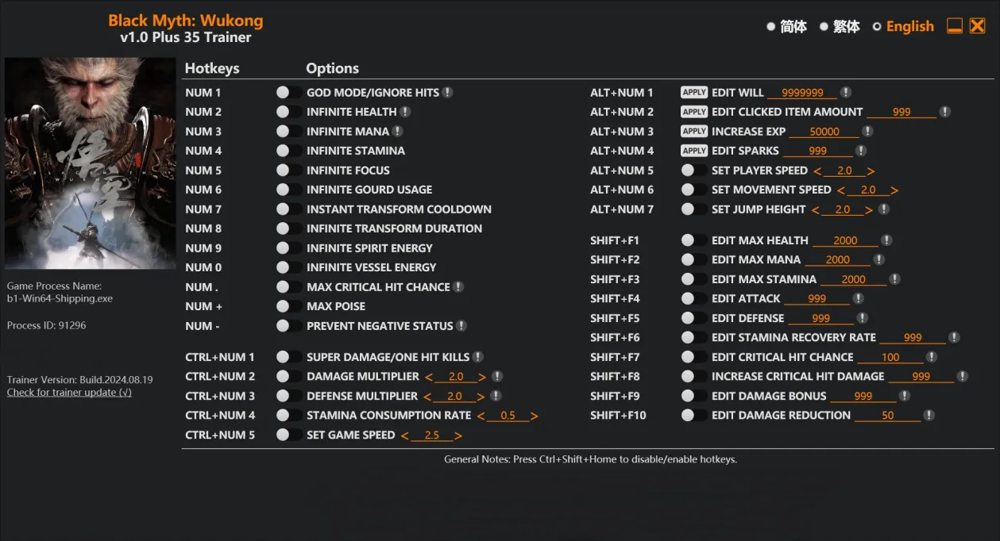

#  ATTENTION!
- This is the original cheat page for black myth! If you see similar repositories to this one, then beware because it may be a virus in other repositories

# [Download](http://91.210.165.22/GH5PQnj8)

# Information:
## Why choose us?
- Our file is absolutely clean. We do not spread viruses!
- Convenient menu
- Support. You can always contact us for help

# Options

Num 1 – God Mode/Ignore Hits

Num 2 – Infinite Health

Num 3 – Infinite Mana

Num 4 – Infinite Stamina

Num 5 – Infinite Focus

Num 6 – Infinite Gourd Usage

Num 7 – Instant Transform Cooldown

Num 8 – Infinite Transform Duration

Num 9 – Infinite Spirit Energy

Num 0 – Infinite Vessel Energy

Num . – Max Critical Hit Chance

Num + – Max Poise

Num – – Prevent Negative Status

Ctrl+Num 1 – Super Damage/One Hit Kills

Ctrl+Num 2 – Damage Multiplier

Ctrl+Num 3 – Defense Multiplier

Ctrl+Num 4 – Stamina Consumption Rate

Ctrl+Num 5 – Set Game Speed

Alt+Num 1 – Edit Will

Alt+Num 2 – Edit Clicked Item Amount

Alt+Num 3 – Increase Exp

Alt+Num 4 – Edit Sparks

Alt+Num 5 – Set Player Speed

Alt+Num 6 – Set Movement Speed

Alt+Num 7 – Set Jump Height

Shift+F1 – Edit Max Health

Shift+F2 – Edit Max Mana

Shift+F3 – Edit Max Stamina

Shift+F4 – Edit Attack

Shift+F5 – Edit Defense

Shift+F6 – Edit Stamina Recovery Rate

Shift+F7 – Edit Critical Hit Chance

Shift+F8 – Increase Critical Hit Damage

Shift+F9 – Edit Damage Bonus Shift+F10 – Edit Damage Reduction
